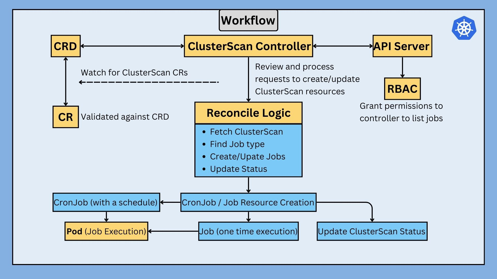

## Overview
The `ClusterScan` controller is a custom Kubernetes controller designed to manage and automate the execution of cluster-wide scanning jobs. It allows users to define scan jobs using custom resources, enabling scheduled or on-demand scans with a flexible configuration.

## Description
The `ClusterScan` project provides a robust solution for running periodic or immediate scan jobs across a Kubernetes cluster. By defining a `ClusterScan` custom resource, users can specify the schedule and job template, allowing for easy integration with existing CI/CD pipelines and security workflows. The controller manages the lifecycle of these scan jobs, ensuring they are executed as per the specified schedule and reporting the results back to the cluster.

## Architecture


### Prerequisites
- go version v1.21.0+
- docker version 17.03+.
- kubectl version v1.11.3+.
- Access to a Kubernetes v1.11.3+ cluster.

### To Deploy on the cluster
**Build and push your image to the `Docker Hub`:**

```sh
docker build -t <some-registry>/clusterscan-operator:tag .
docker push <image_name>
```

**NOTE:** This image ought to be published in the personal registry you specified.
And it is required to have access to pull the image from the working environment.
Make sure you have the proper permission to the registry if the above commands don’t work.

**Change the image name in `config/manager/manager.yaml`:**

```yaml
containers:
  image: <some-registry>/clusterscan-operator:latest
```


**Install the CRDs into the cluster:**

```sh
make install
```

**Deploy the Manager to the cluster:**

```sh
make deploy
```

> **NOTE**: If you encounter RBAC errors, you may need to grant yourself cluster-admin
privileges or be logged in as admin.

**Create instances of your solution**
You can apply the samples (examples) from the config/sample:

```sh
kubectl apply -k config/samples/
```

>**NOTE**: Ensure that the samples has default values to test it out.

### Useful commands
```sh
kubectl get clusterscan
kubectl describe clusterscan <scan_name>
kubectl get jobs
kubectl get cronjob -w
kubectl describe job job_name
kubectl get pods
kubectl logs pod_name
```
### To Uninstall
**Delete the instances (CRs) from the cluster:**

```sh
kubectl delete -k config/samples/
```

**Delete the APIs(CRDs) from the cluster:**

```sh
make uninstall
```

**UnDeploy the controller from the cluster:**

```sh
make undeploy
```

## Project Distribution

Following are the steps to build the installer and distribute this project to users.

1. Build the installer for the image built and published in the registry:

```sh
make build-installer IMG=<some-registry>/clusterscan-operator:tag
```

NOTE: The makefile target mentioned above generates an 'install.yaml'
file in the dist directory. This file contains all the resources built
with Kustomize, which are necessary to install this project without
its dependencies.

2. Using the installer

Users can just run kubectl apply -f <URL for YAML BUNDLE> to install the project, i.e.:

```sh
kubectl apply -f https://raw.githubusercontent.com/<org>/clusterscan-operator/<tag or branch>/dist/install.yaml
```
