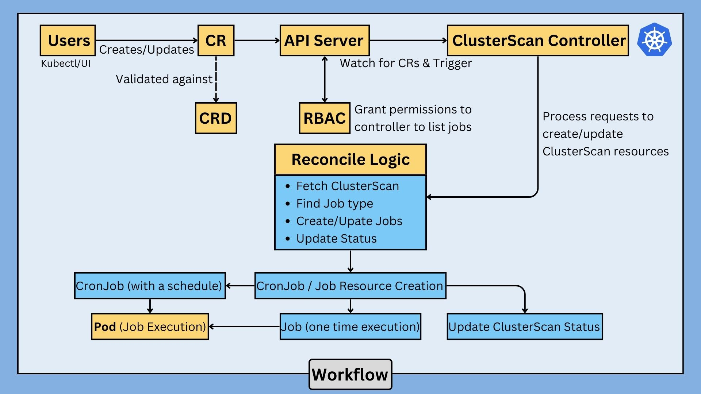
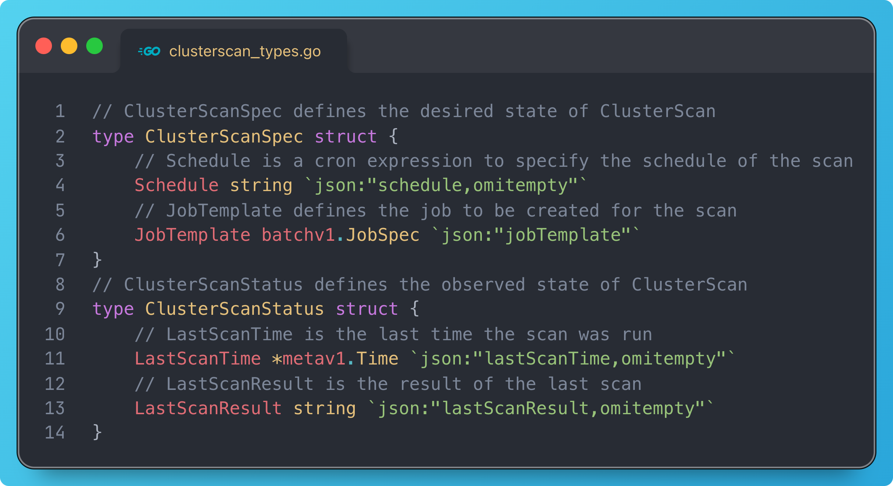

## Overview
The `ClusterScan` controller is a custom Kubernetes controller designed to manage and automate the execution of cluster-wide scanning jobs. It allows users to define scan jobs using custom resources, enabling scheduled or on-demand scans with a flexible configuration.

## Description
The `ClusterScan` project provides a robust solution for running periodic or immediate scan jobs across a Kubernetes cluster. By defining a `ClusterScan` custom resource, users can specify the schedule and job template, allowing for easy integration with existing CI/CD pipelines and security workflows. The controller manages the lifecycle of these scan jobs, ensuring they are executed as per the specified schedule and reporting the results back to the cluster.

## Completed Assignment Requirements

- Custom Controller - ClusterScan ✅
- Spec and Status ✅
- Jobs (One-time execution) ✅
- Cron Jobs (Scheduled/Recurring Execution) ✅

## Demo

- [Demo Video]()
- [Demo Presentation](./Documentation/Presentation.pdf)
## Architecture


### Prerequisites
- go version v1.21.0+
- docker version 17.03+.
- kubectl version v1.11.3+.
- Access to a Kubernetes v1.11.3+ cluster.

### Custom Resource Definition (CRD)
- Users define a `ClusterScan` resource that specifies the schedule and job template for scanning.
- Update the `status` of the ClusterScan resource to reflect the current state and last execution time.



### Reconciliation Logic for ClusterScan

#### Main Steps:

- <h4>Fetch ClusterScan Instance:</h4>The controller fetches the ClusterScan instance specified in the reconcile request. If the instance is not found (deleted), it returns without error.

- <h4>Determine Job Type:</h4>If a schedule is specified, create or update a `CronJob`. If no schedule is specified, create or update a `one-time Job`.


- <h4>Create/Update CronJob or Job:</h4>Set ClusterScan as the owner of the created job to ensure proper garbage collection. If the job or cron job already exists, update it as needed; otherwise, create a new one.
- <h4>Update ClusterScan Status:</h4> Update the ClusterScan status with the `last scan time` and `last scan result`.
- <h4>Error Handling:</h4>Proper error handling to ensure retries and logging in case of transient errors.

### To Deploy on the cluster
**Build and push your image to the `Docker Hub`:**

```sh
docker build -t <some-registry>/clusterscan-operator:tag .
docker push <image_name>
```

**NOTE:** This image ought to be published in the personal registry you specified.
And it is required to have access to pull the image from the working environment.
Make sure you have the proper permission to the registry if the above commands don’t work.

**Change the image name in `config/manager/manager.yaml`:**

```yaml
containers:
  image: <some-registry>/clusterscan-operator:latest
```


**Install the CRDs into the cluster:**

```sh
make install
```

**Deploy the Manager to the cluster:**

```sh
make deploy
```

**Create `ClusterScan` resources:**
You can apply the samples (examples) from the config/sample:

```sh
kubectl apply -k config/samples/
```

>**NOTE**: Ensure that the samples has default values to test it out.

### Useful commands
```sh
kubectl get clusterscan
kubectl describe clusterscan <scan_name>
kubectl get jobs
kubectl get cronjob -w
kubectl describe job job_name
kubectl get pods
kubectl logs pod_name
```
### To Uninstall
**Delete the instances (CRs) from the cluster:**

```sh
kubectl delete -k config/samples/
```

**Delete the APIs(CRDs) from the cluster:**

```sh
make uninstall
```

**UnDeploy the controller from the cluster:**

```sh
make undeploy
```
